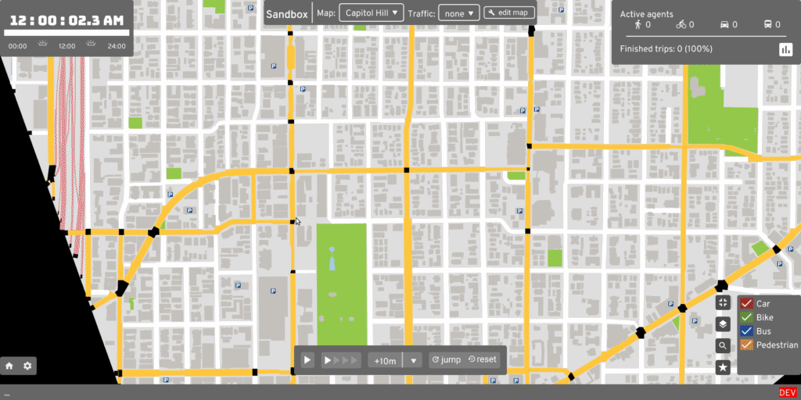
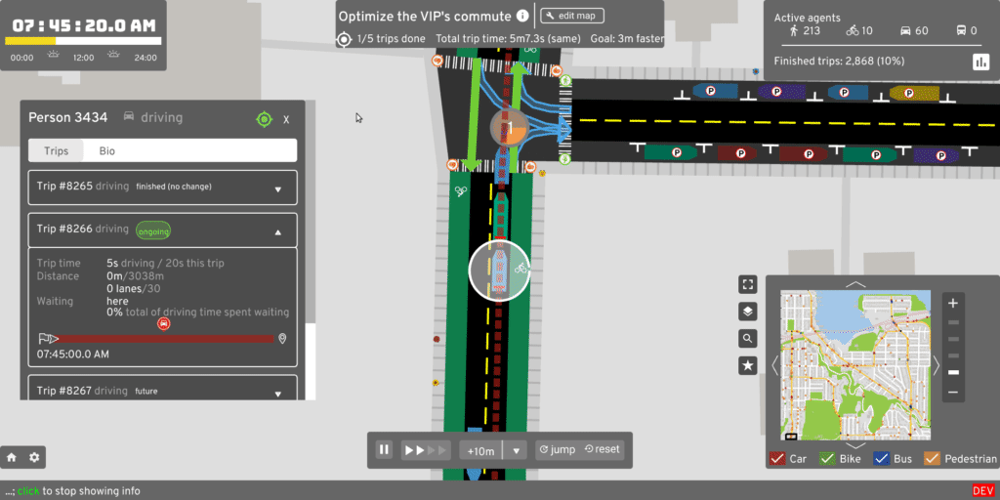

# A/B Street

Ever been stuck in traffic on a bus, wondering why is there legal street parking
instead of a dedicated bus lane? A/B Street is a game exploring how small
changes to a city affect the movement of drivers, cyclists, transit users, and
pedestrians.

- Play on
  [Windows](https://github.com/dabreegster/abstreet/releases/download/v0.2.7/abstreet_windows_v0_2_7.zip),
  [Mac](https://github.com/dabreegster/abstreet/releases/download/v0.2.7/abstreet_mac_v0_2_7.zip),
  [Linux](https://github.com/dabreegster/abstreet/releases/download/v0.2.7/abstreet_linux_v0_2_7.zip),
  [FreeBSD](https://www.freshports.org/games/abstreet/), or
  [read all instructions](https://dabreegster.github.io/abstreet/howto/index.html)
  (new releases every Sunday)
- [build from source](https://dabreegster.github.io/abstreet/howto/dev.html)
  (new changes daily)

## Show, don't tell

[Alpha release trailer](https://www.youtube.com/watch?v=LxPD4n_1-LU)

Find a problem:

Make some changes:

Measure the effects:

## Documentation

- [How A/B Street works](https://dabreegster.github.io/abstreet/how_it_works.html)
- Technical
  - [Developer guide](https://dabreegster.github.io/abstreet/howto/dev.html)
  - [Map model](https://dabreegster.github.io/abstreet/map/index.html)
  - [Traffic simulation](https://dabreegster.github.io/abstreet/trafficsim/index.html)
  - [Running A/B Street in a new city](https://dabreegster.github.io/abstreet/howto/new_city.html)
  - [UX design](https://yuwen-li.com/work/abstreet)
- Presentations
  - April 2020 Rust meetup:
    [recording](https://www.youtube.com/watch?v=chYd5I-5oyc),
    [slides](https://docs.google.com/presentation/d/1nUodhr42eppB2E2eMAnuTkMhIVuHnN7_6i6V6MA028c/edit?usp=sharing)
  - [Feb 2020 traffic sim](https://docs.google.com/presentation/d/181so6bWkGsPzpc-mI72CQffthMKMVzFPAkYxIyzgfAs/edit?usp=sharing)
  - [Oct 2019 Traffic sim and current challenges](https://docs.google.com/presentation/d/1PJRFoXmJAyenkqHIwo48zxqu1LSH6pc7XKSzhyC1raw/edit?usp=sharing)
  - [Oct 2019 Map construction](https://docs.google.com/presentation/d/1cF7qFtjAzkXL_r62CjxBvgQnLvuQ9I2WTE2iX_5tMCY/edit?usp=sharing)
- Project
  - [Roadmap](https://dabreegster.github.io/abstreet/project/roadmap.html)
  - [Motivations](https://dabreegster.github.io/abstreet/project/motivations.html)
  - [History](https://dabreegster.github.io/abstreet/project/history/index.html)

## Roadmap and contributing

See the [roadmap](https://dabreegster.github.io/abstreet/project/roadmap.html)
for current work, including ways to help. If you want to bring this to your city
or if you're skilled in design, traffic simulation, data visualization, or
civic/government outreach, please contact Dustin Carlino at
<dabreegster@gmail.com>. Follow [r/abstreet](https://www.reddit.com/r/abstreet/)
for weekly updates or [@CarlinoDustin](https://twitter.com/CarlinoDustin) for
occasional videos of recent progress.

## Project mission

If you fix some traffic problem while playing A/B Street, my ultimate goal is
for your changes to become a real proposal for adjusting Seattle's
infrastructure. A/B Street is of course a game, using a simplified approach to
traffic modeling, so city governments still have to evaluate proposals using
their existing methods. A/B Street is intended as a conversation starter and
tool to communicate ideas with interactive visualizations.

Why not leave city planning to professionals? People are local experts on the
small slice of the city they interact with daily -- the one left turn lane that
always backs up or a certain set of poorly timed walk signals.
[Laura Adler](http://www.govtech.com/data/SimCities-Can-City-Planning-Mistakes-Be-Avoided-Through-Data-Driven-Simulations.html)
writes:

> "Only with simple, accessible simulation programs can citizens become active
> generators of their own urban visions, not just passive recipients of options
> laid out by government officials."

Existing urban planning software is either proprietary or hard to use. A/B
Street strives to be highly accessible, by being a fun, engaging game. See
[here](https://dabreegster.github.io/abstreet/project/motivations.html) for more
guiding principles.

## Credits

Core team:

- Dustin Carlino (<dabreegster@gmail.com>)
- [Yuwen Li](https://www.yuwen-li.com/) (UX)

Others:

- All
  [contributors](https://github.com/dabreegster/abstreet/graphs/contributors)
- Logo by [Ryan Pierson](https://www.ryandpierson.com/)
- Graphic design advice from [Starcat Games](http://starcatgames.com/),
  [Daniel Huffman](https://somethingaboutmaps.wordpress.com/),
  [Brian Prince](http://thebaprince.com/)
- Character art by [Holly Hansel](http://www.hollyhansel.com/)
- Lightning-fast pathfinding thanks to
  [fast_paths](https://github.com/easbar/fast_paths) by Andreas Barth
  (<easbar.mail@posteo.net>)
- Hackathon drop-ins from [Democracy Lab](https://www.democracylab.org/) events
- [CUGOS](https://cugos.org/) and [Julian Michael](http://julianmichael.org/)
  have been great sounding boards for ideas since the beginning
- In-game character faces adapted from
  [Anokhee Jandhyala](https://github.com/anokhee/visual-synthesizer)
- Pandemic modeling by Orestis Malaspinas (<orestis.malaspinas@hesge.ch>)
- Game design advice from Christopher Klein
- OSM expertise courtesy [Mateusz Konieczny](https://github.com/matkoniecz)
- Lots of helpful PRs from [Javed Nissar](https://github.com/RestitutorOrbis)
  and [Michael Kirk](https://github.com/michaelkirk)
- Lots of help with rendering SVG and fonts from
  [RazrFalcon](https://github.com/RazrFalcon) and
  [nical](https://github.com/nical)

Data:

- Special thanks to all [OpenStreetMap](https://www.openstreetmap.org/about)
  contributors!
- [King County GIS](https://www.kingcounty.gov/services/gis.aspx)
- [Seattle Open Data](https://data.seattle.gov/)
- [Puget Sound Regional Council](https://www.psrc.org/)
