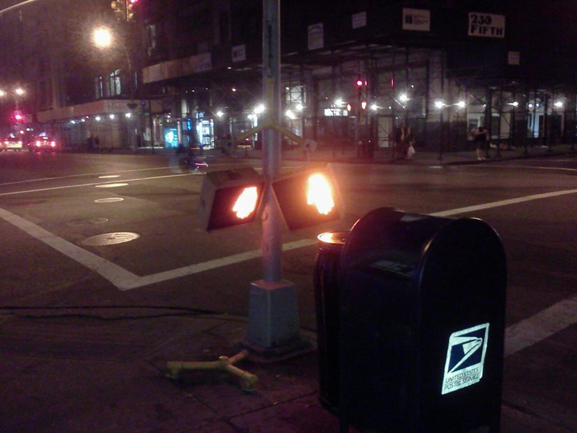
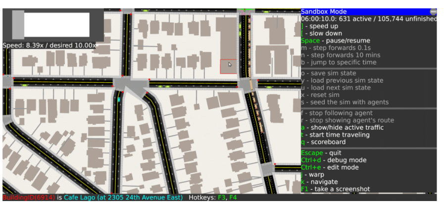

# Project history

As of June 2020.

tldr: A/B Street has been in active development since June 2018, but the idea
has been festering since I was about 16.

<!--ts-->
   * [Project history](#project-history)
      * [Backstory](#backstory)
      * [Year 1 (June 2018-2019)](#year-1-june-2018-2019)
      * [Year 2 (June 2019-2020)](#year-2-june-2019-2020)
      * [Retrospective](#retrospective)
      * [Trivia](#trivia)

<!-- Added by: dabreegster, at: Mon Jun  8 12:16:39 PDT 2020 -->

<!--te-->

## Backstory

I originally wanted to tell a much longer story here of how I came to work on
A/B Street, but I'm not sure this is the right time yet. So consider this the
quick version.

I grew up in Baton Rouge, where driving is effectively the only mode of
transport. (I've gone back and made a point of taking long walks to confirm how
antagonistically the city is designed towards walking.) Very early on, I fell in
love with a Nintendo 64 game called Banjo Kazooie, which led me to the online
fan communities of the early 2000's. I wanted to create games too, so I started
learning programming via library books and lots of questions on IRC. Because I
never had any confidence in art, I wound up working on roguelikes, which led to
a fervent interest in pathfinding algorithms and
[collaborative diffusion](http://www.cs.colorado.edu/~ralex/papers/PDF/OOPSLA06antiobjects.pdf).
When I started driving in high school, I quickly realized how bad people were at
it. I remember being stuck at the intersection of
[Florida Blvd and Cloud](https://www.openstreetmap.org/node/1279204989) and
first wondering if the pathfinding algorithms could help with traffic. Can you
see where this is going?

I moved to Austin for college. One of the first days of class, I shuffled down
the stairs of Gearing Hall past a crackly old speaker apocalyptically announcing
the weather forecast (details add color, right?) into a seminar demanding a
totally open-ended first assignment to do something interesting. After I left,
somebody stopped to ask me for directions, but I didn't know campus well yet. I
thought about how Google Maps gave really silly walking directions. So I decided
I'd hand-draw a map of campus, showing all of the construction, how to cut
through the labryinth that is Welch Hall on hot days, and where to find the 24/7
robot coffee machines, and hack together a routing engine to help people find
the shortest path between their classes. The feedback I got on this assignment
included something along the lines of, "I was really pretty impressed first that
you would be so stupid as to actually try to do this..."

But I did, and that led me to discovering OpenStreetMap, which it turns out was
pretty pivotal. (The first version of my campus map was seeded vaguely off an
official paper map, but mostly I walked around and invented half-assed surveying
methods on the spot.) Next semester, I joined a freshman research stream with
somebody who had worked on [AIM](http://www.cs.utexas.edu/~aim/), UT's
demonstration that autonomous vehicles wouldn't need traffic lights. Everything
came together, and I started a 3 year journey of building
[AORTA](https://github.com/dabreegster/aorta/), a traffic simulator for AVs.
Guided by the research lab, I explored the really bizarre idea of letting AVs
[bid to turn lights green sooner](http://www.cs.utexas.edu/~aim/papers/ITSC13-dcarlino.pdf)
and micro-tolling all roads to disincentivize congestion. Both of these
mechanisms would be incredibly unfair to people without the spare cash to back
up their high value-of-time, but I brushed this off by saying the currency could
be based on carpooling, EVs, etc.

It was great to try research in college; I learned I _really_ dislike munging
data and compressing my work into 6 pages of conference paper LaTeX. So I moved
to Seattle to work in industry instead, on something completely unrelated to
transportation. Lots of things began unravelling for me in Seattle, but one of
them was biking. In Austin, I had picked up mountain biking, and all but stopped
driving; it was an amazing place to explore and commute by bike. Seattle was
different. There were many more cyclists around, but the experience felt more
stressful, the drivers more aggressive. I had plenty of near-misses. I kept
commuting by bike, but the joy of it was gone. I started noticing how many cars
were parked on narrow arterials and wondering why that was a fair use of space.
I started paying attention to the public discourse around bike infrastructure in
Seattle and feeling like the conversation was... chaotic.

Fast forward to late 2017. This is where I'll omit chunks of the story. I
visited London, my first experience with a city that took public transit
seriously. When I returned, lots of latent ideas stopped fermenting and started
exploding. I threw together a prototype of A/B Street and started the arduous
process at work of open-sourcing it and applying to a program to let me work it
on for a few quarters. A few months later, I wound up quitting instead, and
began to work on A/B Street in earnest.

## Year 1 (June 2018-2019)

I skimmed through git and summarized roughly what I was working on each month,
calling out milestones. "UI churn" is pretty much constantly happening.

- June: polyline geometry and lanes, building paths, protobuf -> serde

- July: pedestrians, bikes, parked cars, lane edits
- August: porting AORTA's discrete-time driving model
- September: multi-leg trips, buses, the first ezgui wizard, randomized
  scenarios

- October: A/B test mode (and so per-map plugins), forking RNG for
  edit-invariance, intersection geometry
- November: clipping / borders, using blockface for parking, time travel mode,
  test runner framework
- December: bezier curves for turns, traffic signal editor, a first attempt at
  merging intersections, right-click menus, a top menu, modal menus

  - the grand colorscheme refactor: a python script scraped `cs.get_def` calls
    at build-time

- January: careful f64 resolution, ezgui screencapping, synthetic map editor
  - **grand refactor**: piston to glium
- February: attempting to use time-space intervals for a new driving model, new
  discrete-event model instead
  - **Feb 19-27**: conceiving and cutting over to the new discrete event model
- March: fleshing out DES model (laggy heads), first attempt to build on
  windows, gridlock detection

- April: first public releases, splash screen and rearranging game modes
- May: fancier agent rendering, attempting to use census tracts, finding real
  demand data
  - **milestone**: discovered PSRC Soundcast data, much more realistic trips

## Year 2 (June 2019-2020)

- June: contraction hierarchies for pathfinding, stackable game states

- July: OSM turn restrictions, misc (I think I was in Europe?)
- August: pedestrian crowds, agent color schemes, parking blackholes, a big
  `raw_data` refactor to store `Pt2D`, attended first hackathon
- September: offstreet parking, associating parked cars with buildings using
  Soundcast (before that, anybody could use any car!), implemented texture
  support for some reason, doing manual `MapFixes` at scale to fix OSM bugs

  - **milestone**: got the smallest montlake map to run without gridlock

- October: parking sim fixes, opportunistic lane-changing, starting challenge
  modes
- November: prebaked sim results, time-series plots, undo for edit mode, traffic
  signal editor grouping turns
  - **milestone**: Yuwen joins project
- December: the UI reform begins (flexbox, minimap, trip timelines, cutting over
  to SVGs, info panels, scrolling), started naming releases sensibly

  - Project leaked to [HN](https://news.ycombinator.com/item?id=21763636), woops

- January: UI reform continues, the modern tutorial mode appears
- Feburary: UI and tutorial, all text now pure vectors, port to glow+WASM
- March: lockdowns start in US, start grouping trips as a person, population
  heatmap, left-hand driving, info panel and typography overhauls. started
  engaging with Greenways, started effort to map traffic signals

- April: Orestis joins and starts the pandemic model, trip tables, the optimize
  commute challenge, refactor for people's schedules and owned vehicles, trip
  time dat viz, MAJOR progress fixing gridlock at the sim layer
- May: gridlock progress, upstreaming fixes in OSM, differential throughput and
  first real write-up, long-lasting player edits, dedicated parking mapper,
  maybe vanquished the HiDPI bugs, multi-step turn restrictions, random bios for
  people, and docs like this to prep for launch ;)
  - **milestone**: relying on pure OSM, no more `MapFixes`
- June: parking lots

## Retrospective

What poor judgments have cost me the most time?

- UI churn: I should've studied some UX on my own and started with a clear idea
  of how to organize everything
- OSM data quality: I should've gained the confidence to upstream fixes earlier
- Intersection geometry: I should've realized sooner that simulation robustness
  is more important than nice appearance.
- Geometry primitives: I sunk too much time into the polyline problem and f64
  precision.

## Trivia

- The name was almost "Unstreet" or "Superban" (superb urban)
- I hope you enjoy and/or are baffled by the
  [release names](https://github.com/dabreegster/abstreet/releases)
