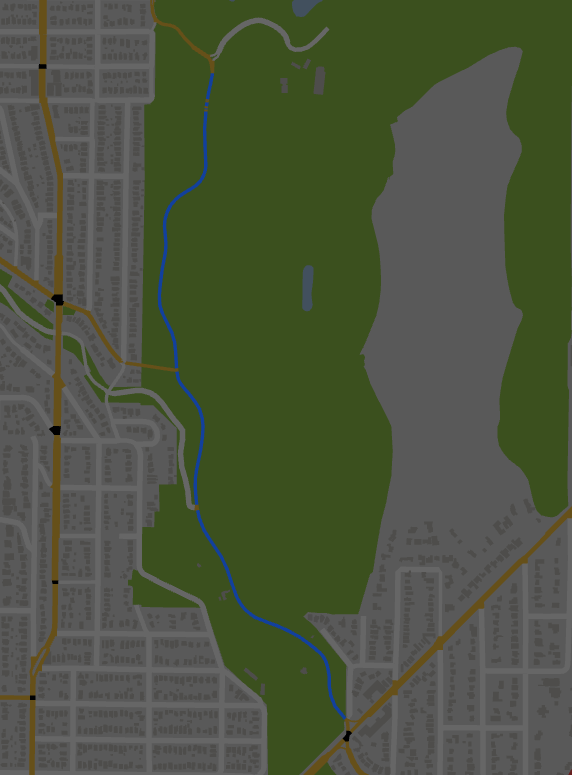

# Lake Washington Blvd Stay Healthy Street

_Draft, updated May 7, 2020 by Dustin Carlino (<dabreegster@gmail.com>)_

In April 2020, Seattle Department of Transportation started rolling out
[Stay Healthy Streets](https://sdotblog.seattle.gov/2020/04/16/announcing-stay-healthy-streets/),
restricting roads to through-traffic to give people walking and biking more
space for social distancing. Selecting the streets requires some planning:

> These streets were selected to amplify outdoor exercise opportunities for
> areas with limited open space options, low car ownership and routes connecting
> people to essential services and food take out. We also ensured street
> closures did not impact newly opened food pick up loading zones, parking
> around hospitals for service for health care professionals, and bus routes.

[Seattle Neighborhood Greenways](http://seattlegreenways.org/socialdistancingstreets/)
soon proposed extending this to a
[130-mile network](https://drive.google.com/open?id=1HQMnagRf8EbS1nouqCMLl4LZr0QE8VrC&usp=sharing).

I've spent the last two years building [A/B Street](https://abstreet.org),
software to explore the impacts of changes like this on different modes of
transportation. So, let's try implementing part of the proposed network and see
what happens!

## Lake Washington Blvd

Let's start with one part of the proposal, closing Lake Washington Blvd to cars
through the Arboretum. There's already a multi-use trail alongside this stretch,
but its width makes it difficult to maintain 6 feet from people. There are some
parking lots that become inaccessible with this proposal, but they're currently
closed anyway.

### First attempt

<iframe width="560" height="315" src="https://www.youtube.com/embed/PU0iT-_3-es" frameborder="0" allow="autoplay; encrypted-media" allowfullscreen></iframe>

Let's get started! If you want to follow along,
[install A/B Street](/docs/instructions.md), open sandbox mode, and switch the
map to Lake Washington corridor. Zoom in on the southern tip of the Arboretum
and hop into edit mode. We can see Lake Washington Blvd just has one travel lane
in each direction here. Click each lane, convert it to a bike lane, and repeat
north until Foster Island Road.

When we leave edit mode, the traffic simulation resets to midnight. Nothing
really interesting happens until 5 or 6am, so we'll speed up time. Watching the
section of road we edited, we'll only see pedestrians and bikes use this stretch
of road. If we want, we can click an individual person and follow along their
journey.

TODO: video of demand, watch someone cut through

Something's weird though. There's lots of traffic cutting northbound through the
neighborhood, along 29th, Ward, and 28th. We can open up the throughput layer to
find which roads have the most traffic. More usefully, we can select "compare
before edits" to see what roads are getting more or less traffic because of the
road we modified. As expected, there's much less traffic along Lake Wash Blvd,
but it's also clear that lots of cars are now cutting through 26th Ave E.

### Traffic calming

TODO: show how to change speed limits and make one-ways

Let's say you want to nudge traffic to use 23rd Ave, the nearest north/south
arterial, instead. (A/B Street is an unopinionated tool; if you have a different
goal in mind, try using it for that instead.) In this simulation, drivers pick
the fastest route, so we could try lowering speed limits or make some of the
residential streets connecting to Madison one-way, discouraging through-traffic.
In reality, the speed limit changes could be implemented through
[traffic calming](https://streetsillustrated.seattle.gov/design-standards/trafficcalming/)
or cheap, temporary alternatives.

TODO: video of effects

This is just one example how to mitigate the unintended consequences of closing
Lake Washington Blvd.

TODO: find impacted trips, watch them detour?

## Next steps

I'm working to model "local access only" roads in A/B Street. Stay tuned to see
more of the
[proposed network](https://drive.google.com/open?id=1HQMnagRf8EbS1nouqCMLl4LZr0QE8VrC&usp=sharing)
simulated, and get in touch if you'd like to help out!
