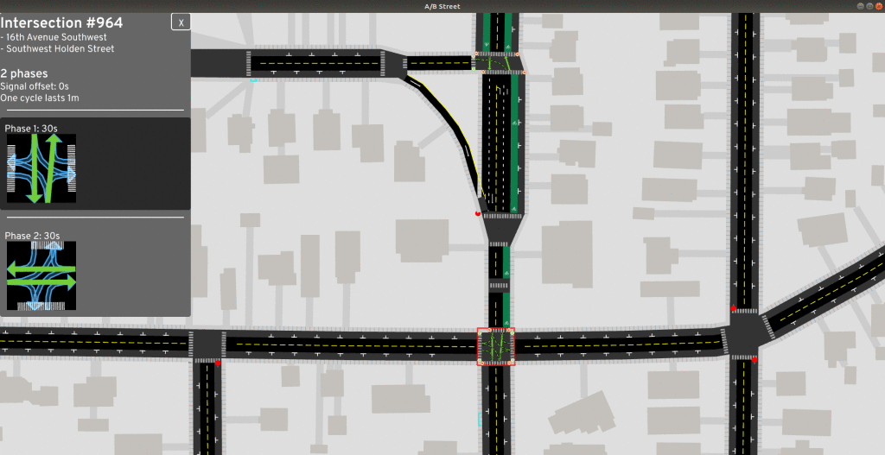

# West Seattle mitigations

_Draft, updated May 14, 2020 by Dustin Carlino (<dabreegster@gmail.com>)_

In March 2020, the West Seattle bridge was closed due to cracks forming. As of
May, COVID-19's impact on commuting means the area still hasn't seen how the
area will handle losing the main route to the rest of Seattle. A local group,
HPAC, published a list of
[requests to SDOT](https://www.westsideseattle.com/robinson-papers/2020/05/04/highland-park-action-coalition-calls-seattle-officials-traffic)
to prepare the area for these changes.

This page will try to explore some of the problems and solutions from HPAC's
document using [A/B Street](https://abstreet.org), a traffic simulator designed
to explore the impacts of changes like this on different modes of
transportation.

> **_NOTE:_** You might want to read [how A/B Street works](../how_it_works.md)
> first.

## 16th Ave SW and SW Holden St

HPAC has been asking for a protected left-turn phase at this intersection. I'm
unfamiliar with this intersection and currently unable to scout in-person, so
I'm blindly guessing the traffic signal currently has just two phases:

From watching the traffic, it seems like the east/west direction is busier, with
lots of eastbound traffic headed towards WA-509. Holden St has no turn lanes, so
a protected left turn phase makes sense. Let's make the change and see what
happens:

<iframe width="560" height="315" src="https://www.youtube.com/embed/6tooJaZLa0Q" frameborder="0" allow="autoplay; encrypted-media" allowfullscreen></iframe>

Unfortuately, we can't evaluate the change yet, because the simulation gets
stuck with unrealistic traffic jams in other parts of the map. This is mostly
due to data quality issues in OpenStreetMap and incorrectly guessed traffic
signal timings. These problems can be fixed with the help of somebody familiar
with the area.

## Re-evaluate arterials

The 9th item from HPAC's list asks for measuring the amount of east-west traffic
to figure out what streets people are using as arterials. That's an easy
analysis, using the _throughput_ layer.

<iframe width="560" height="315" src="https://www.youtube.com/embed/yzp9c7gHhOI" frameborder="0" allow="autoplay; encrypted-media" allowfullscreen></iframe>

By 6am, the busiest streets include Admiral Way, S Charlestown, SW Genesee, SW
Alaska, SW Holden, and SW Roxbury St. Again, it's necessary to first fix data
quality problems and run a full day before doing more analysis.

Once the simulation is running smoothly, A/B Street can be used to make changes
-- like lowering speed limits, adding a protected left turn phase, or converting
part of the road into a bus lane -- and evaluate the effects on individual trips
and aggregate groups.
